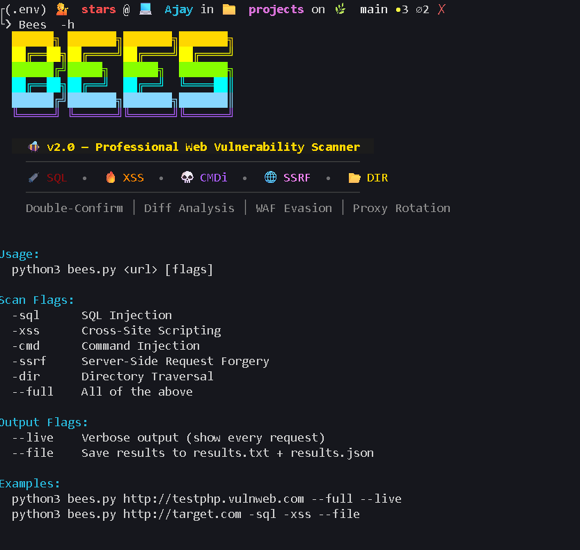
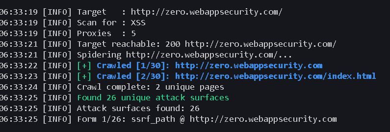
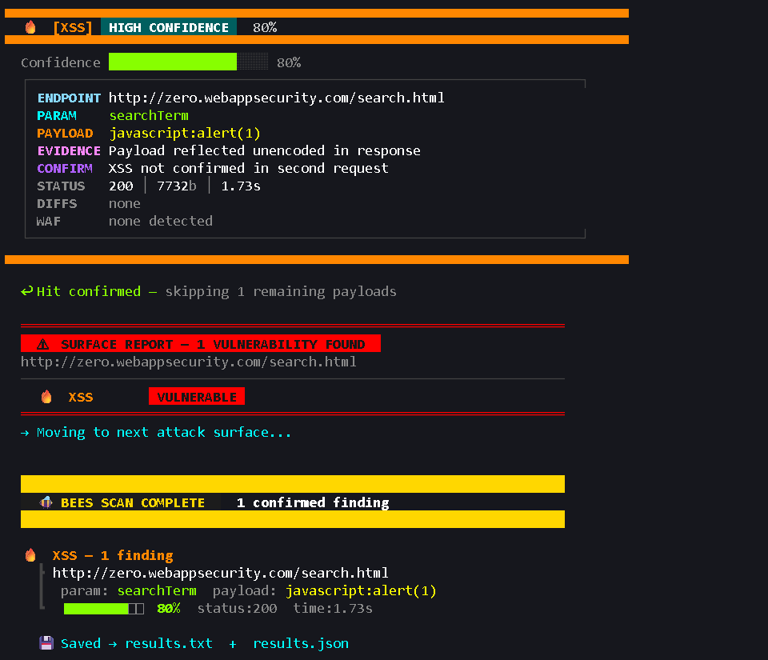

# 🐝 BEES — Automated Web Application Vulnerability Scanner

> Final Year B.E. Computer Science Project | DMI Engineering College

A professional-grade automated web application vulnerability scanner built from scratch in Python. BEES combines intelligent crawling, multi-vector payload testing, WAF detection and evasion, proxy rotation, and double-confirmation logic to minimize false positives - similar to how tools like SQLMap and Burp Suite operate under the hood.

---

## 📸 Screenshots

| Banner & Help | Live Crawl | XSS Finding |
|---|---|---|
|  |  |  |

---

## 🎯 What It Does

BEES crawls a target web application, discovers all attack surfaces (forms, URL parameters, JS-embedded endpoints), and tests each one for five vulnerability classes:

| Symbol | Type | Description |
|--------|------|-------------|
| 💉 | **SQL Injection** | Error-based, UNION-based, boolean-based, time-based blind |
| 🔥 | **XSS** | Reflected XSS with unencoded reflection verification |
| 💀 | **Command Injection** | Output-based and time-based detection |
| 🌐 | **SSRF** | Cloud metadata, internal IP, file protocol handlers |
| 📂 | **Directory Traversal** | Linux/Windows path traversal with encoding bypasses |

---

## 🏗️ Architecture

```
bees/
├── bees.py             ← Core scanner (payloads, detection, reporting)
├── web_scraping.py     ← Crawler + attack surface discovery
├── proxy.py            ← Multi-source proxy fetcher + validator
├── sql.txt             ← Extended SQL injection payload list
├── xss.txt             ← Extended XSS payload list
├── cmd.txt             ← Extended command injection payloads
├── ssrf.txt            ← Extended SSRF payloads
├── dir.txt             ← Extended directory traversal payloads
└── results/
    ├── results.txt     ← Human-readable findings
    └── results.json    ← Structured JSON report
```

---

## ⚙️ Key Features

### 🕷️ Intelligent Crawler (`web_scraping.py`)

- **BFS crawling** with configurable depth and page limits
- **SQLMap-style URL deduplication** — parameter-name fingerprinting means `/page?id=1` and `/page?id=99` are treated as the same endpoint, cutting redundant tests
- **JS link extraction** - regex patterns pull endpoints embedded in inline JavaScript, similar to Burp Suite's passive scanner
- **Form detection** - classifies forms by type (login, search, upload, admin) to prioritize testing
- **robots.txt support** - respects crawl rules, avoidable with a flag
- **Selenium fallback** - renders JS-heavy pages when Chrome is available, falls back to `requests` silently
- **Pre-flight checks** - DNS resolution and HTTP reachability tested before crawling starts to fail fast with clear error messages
- **Session replay protection** - skips logout/signout URLs to avoid breaking the crawl session

### 🔬 Scanner Engine (`bees.py`)

#### Double-Confirmation System
When a potential vulnerability is detected, a second request with a semantically different but equivalent payload is sent to confirm. For SQL injection this means testing both a true-condition and a false-condition - a real injection returns different content for each, a false positive returns identical content.

#### Differential Response Analysis
Every scan starts with a baseline request. Injected responses are compared against the baseline across five dimensions: status code, content length, word count, error count, and page title. A similarity score below 0.75 flags structural change - this is the same core technique SQLMap uses.

#### Two-Phase Payload Strategy
- **Phase 1** - hardcoded built-in payloads (fast, always available)
- **Phase 2** - loads extended payload lists from `.txt` files, skipping any already tested in Phase 1
- Once a vulnerability is confirmed on a parameter, remaining payloads for that parameter are skipped

#### WAF Detection & Evasion
Detects Cloudflare, ModSecurity, Akamai, AWS WAF, Sucuri, Incapsula, Barracuda, and F5 BIG-IP from response headers and body. When a WAF is detected, payloads are automatically run through evasion wrappers (comment injection, URL encoding, case mixing, null bytes, IFS substitution).

#### Time-Based Blind Detection
Baseline response time is sampled across multiple requests. A sleep payload is confirmed only if elapsed time exceeds `baseline + (sleep_seconds × 0.8)` - this accounts for network jitter and avoids false positives from slow servers.

### 🔄 Proxy Rotation (`proxy.py`)

Fetches working elite proxies from four sources in priority order:
1. pubproxy.com API
2. proxyscrape.com API
3. openproxylist.net
4. GitHub community proxy lists (fallback, always available)

Every proxy is validated against `httpbin.org/ip` before use. Dead proxies are culled on startup. Scan never begins with zero proxies - your real IP is never exposed to the target.

---

## 🚀 Usage

### Install Dependencies

```bash
pip install requests beautifulsoup4 selenium urllib3
```

### Basic Scan

```bash
# XSS only
python3 bees.py http://target.com -xss

# SQL + XSS
python3 bees.py http://target.com -sql -xss

# Full scan, verbose output, save results
python3 bees.py http://target.com --full --live --file
```

### Flags

```
Scan Flags:
  -sql      SQL Injection
  -xss      Cross-Site Scripting
  -cmd      Command Injection
  -ssrf     Server-Side Request Forgery
  -dir      Directory Traversal
  --full    All of the above

Output Flags:
  --live    Verbose - show every request in real time
  --file    Save findings to results.txt + results.json
```

---

## 📊 Output

Each confirmed finding includes:

- Vulnerability type and confidence score (50–99%)
- Endpoint, parameter name, and exact payload
- Evidence string (what triggered the detection)
- Confirmation result (double-confirmation pass/fail)
- Differential analysis notes (what changed vs baseline)
- Response status, size, elapsed time
- WAF detected (if any)

Findings are saved as both a human-readable `.txt` report and a structured `.json` file for parsing or integration with other tools.

---

## 🧪 Tested Against

- [DVWA](http://dvwa.co.uk/) - Damn Vulnerable Web Application
- [WebGoat](https://github.com/WebGoat/WebGoat) - OWASP WebGoat
- [zero.webappsecurity.com](http://zero.webappsecurity.com) - intentionally vulnerable demo app
- [testphp.vulnweb.com](http://testphp.vulnweb.com) - Acunetix test target

> **All testing was performed on intentionally vulnerable targets in isolated lab environments.**

---

## 🗺️ MITRE ATT&CK Coverage

| Technique | ID | Detected By |
|-----------|-----|-------------|
| Exploit Public-Facing Application | T1190 | SQL, XSS, CMD, SSRF, DIR |
| OS Command Injection | T1059 | CMD module |
| Server-Side Request Forgery | T1090.002 | SSRF module |
| Unsecured Credentials via Config Files | T1552.001 | DIR traversal module |

---

## 🔒 Legal & Ethical Notice

This tool was built **exclusively for educational purposes** as a final year project. All testing was conducted against intentionally vulnerable applications or systems I own and control. Never use this tool against systems without explicit written authorization. Unauthorized scanning is illegal in most jurisdictions.

---

## 🛠️ Tech Stack

- **Python 3** - core language
- **requests** - HTTP client
- **BeautifulSoup4** - HTML parsing
- **Selenium + ChromeDriver** - JS rendering (optional)
- **urllib3** - connection pooling and retry logic

---

## 👤 Author

**Ajay J**  
B.E. Computer Science, DMI Engineering College, Nagercoil    
LinkedIn: [linkedin.com/in/ajay-j-5b23b62a9](https://linkedin.com/in/ajay-j-5b23b62a9)
